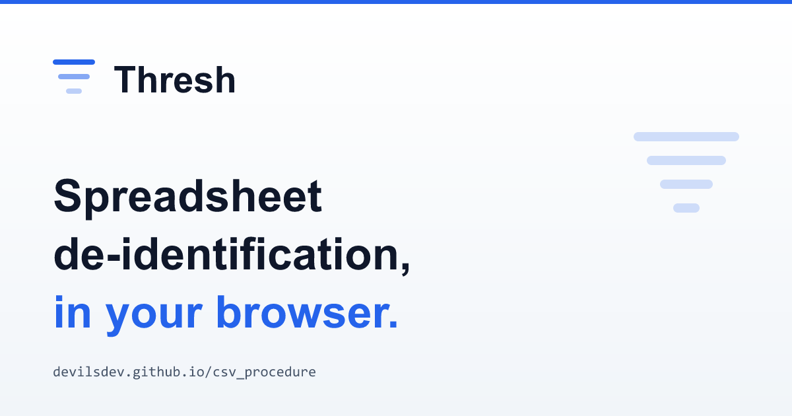

<div align="center">



# Thresh

**Privacy-first spreadsheet ETL.** Strip identifiers, anonymize patient codes, convert dates of birth, and ship analysis-ready CSVs — without the workbook ever touching a database.

[](https://github.com/DevilsDev/csv_procedure/actions)
[](https://github.com/DevilsDev/csv_procedure/actions/workflows/docs.yml)
[](LICENSE)
[](https://github.com/DevilsDev/csv_procedure/actions)
[](https://devilsdev.github.io/csv_procedure/tool/)
[](https://devilsdev.github.io/csv_procedure/)

[**Try the in-browser tool**](https://devilsdev.github.io/csv_procedure/tool/) · [**Documentation**](https://devilsdev.github.io/csv_procedure/) · [**Report an issue**](https://github.com/DevilsDev/csv_procedure/issues)

</div>

---

## What it is

Thresh takes spreadsheet exports of structured data — Excel workbooks across multiple sheets — and returns de-identified, analysis-ready CSVs. The cleaning rules ship with healthcare-friendly defaults (anonymize `NHI`, convert `DOB` to `Age`, drop `Address` and `Contact`, dedupe) but the underlying engine is general-purpose: every rule is configurable, the patterns are auditable, and the same engine runs in three places.

> The npm package and GitHub repo are still named `csv_procedure` for historical reasons; the product is **Thresh**.

## Highlights

| | |
|---|---|
| **Auto-detection** | Drop in any workbook and see the columns Thresh thinks are sensitive (email, NHI, DOB, name, postcode, age, gender, IP, …) before any cleaning runs. The detection compiles directly into a runnable rule set. |
| **k-anonymity scoring** | After cleaning, see whether the rows that remain still re-identify people in combination. Get back `k`, the equivalence-class histogram, and a green/amber threshold tile. |
| **Three surfaces, one engine** | An Express server, a real CLI (`thresh clean / preview / detect`), and a 100% in-browser tool — same cleaning rules in all three, with a parity test in CI to keep them honest. |
| **Configurable rules** | Replace the defaults with a JSON rule set via env var, CLI flag, or the browser tool's editor — match by `equals` / `startsWith` / `contains` / `regex` / `empty`, act with `drop` / `keep` / `rename` / `redact` / `anonymize` / `ageFromDate`. |
| **Privacy by default** | API-key auth, per-IP rate limiting (in-memory or Redis-backed), optional ClamAV scanning, configurable output retention. The in-browser tool sends *nothing* to any server. |

## Three ways to use it

### 1. In your browser — no install, no upload

Open <https://devilsdev.github.io/csv_procedure/tool/> in any modern browser. Click **Try with a sample workbook** to see the full flow end-to-end, or drop in your own file. Everything — parsing, cleaning, k-anonymity scoring, CSV download — happens locally in the tab. Nothing is uploaded.

### 2. As a CLI

```bash
# Run the ETL on a workbook and write CSVs + manifest to ./out
npx thresh clean ./case-mix.xlsx -o ./out

# Dry-run: emit a JSON report (with k-anonymity) and write nothing
npx thresh preview ./case-mix.xlsx --rules ./my-rules.json

# Auto-detect likely PHI / PII columns and emit a suggested rule set
npx thresh detect ./case-mix.xlsx
npx thresh detect ./case-mix.xlsx --apply -o ./out   # detect + clean in one go

# Start the HTTP server
npx thresh serve --port 3000
```

Both `thresh` and `clinisync` are exposed as bin names. Run `npx thresh help <command>` for full options.

### 3. As an HTTP server

```bash
git clone https://github.com/DevilsDev/csv_procedure.git
cd csv_procedure
npm install
npm run setup           # creates uploads/, csvs/, demo fixtures
npm run dev             # http://localhost:3000
```

```bash
curl -F "excel=@./case-mix.xlsx" \
     -H "Authorization: Bearer $CLINISYNC_API_KEY" \
     http://localhost:3000/upload
```

| Method | Path | Purpose |
|---|---|---|
| `POST` | `/upload` | Run ETL, write per-sheet CSVs + manifest, return JSON describing them |
| `POST` | `/preview` | Dry-run — same pipeline, no files written, response includes inline preview rows + k-anonymity report |
| `POST` | `/detect` | Scan for PHI/PII/quasi-identifier columns, return a suggested rule set |
| `GET` | `/downloads/:filename` | Retrieve a previously generated CSV / manifest (strict allowlist + auth) |

See [.env.example](./.env.example) for runtime configuration: `CLINISYNC_API_KEY`, `CLINISYNC_RULES_PATH`, `CLINISYNC_CSV_TTL_HOURS`, `REDIS_URL`, `CLAMAV_TCP_HOST`.

## Auto-detection

Thresh ships a curated pattern library that scores each column on header hints + sampled values. First match wins; unmatched columns are kept as-is.

| Pattern | Severity | Suggested action |
|---|---|---|
| email · ssn · creditcard · phone · nhi · mrn · ip | direct | redact / anonymize |
| dob | direct | DOB → Age |
| name · address | direct | redact / drop |
| postcode · age · gender · generic date | quasi-identifier | (kept; flagged for k-anonymity) |

Detection is identical on the server, in the CLI, and in the browser — guarded by a parity test in CI. Patterns flagged `headerRequired: true` (DOB, age, postcode, gender, MRN, phone, credit card) only fire when the header confirms — a date-shaped value alone won't trigger DOB detection.

## k-anonymity

After cleaning, Thresh groups rows by their quasi-identifier tuple (e.g. `[Age, Postcode, Gender]`) and reports:

- `k` — the smallest group size in the data
- `singletonRows` — rows uniquely identified by their QI combination
- `histogram` — counts per group size, ascending
- `satisfiesMinK` — whether `k ≥ minK` (default `5`, configurable on the rule set)

The browser tool surfaces this as a stat tile that flips amber when the threshold isn't met. The `/preview` and CLI reports include the same data per-sheet plus an aggregate (workbook-wide minimum k).

## Configurable rules

```json
{
  "version": "1",
  "rules": [
    { "match": { "empty": true },          "action": "drop" },
    { "match": { "startsWith": "column" }, "action": "drop" },
    { "match": { "equals": "nhi" },        "action": "anonymize",   "outputName": "ID" },
    { "match": { "equals": "dob" },        "action": "ageFromDate", "outputName": "Age" },
    { "match": { "equals": "phone" },      "action": "redact",      "replaceWith": "<phone>" },
    { "match": { "regex": "^internal_" }, "action": "drop" }
  ],
  "kAnonymity": { "quasiIdentifiers": ["Age", "Postcode", "Gender"], "minK": 5 }
}
```

Pass it via:

- **Server**: `CLINISYNC_RULES_PATH=./rules.json`
- **CLI**: `thresh clean ./input.xlsx --rules ./rules.json`
- **Browser**: paste it into the *Custom rules* editor on the tool

Schema and behavior are documented at [/cleaning/fields](https://devilsdev.github.io/csv_procedure/cleaning/fields).

## What this project is — and isn't

**It is** a small, opinionated cleaning layer that sits in front of analytics. The default rules are healthcare-flavored; the engine is general-purpose. Detection, scoring, and configurable rules are the headline features.

**It isn't** a HIPAA-certified product, a managed service, an audit-logged platform, a cross-upload patient registry, or a database. There is no persistence beyond on-disk CSVs that are swept after `CLINISYNC_CSV_TTL_HOURS` (default 24h). If you're operating under regulatory constraints, embed Thresh inside a compliant environment — it isn't the compliant environment itself.

The [Security](https://devilsdev.github.io/csv_procedure/mission/security) docs page lists every guarantee the code makes — and equally explicitly, every guarantee it does not.

## Project layout

```
csv_procedure/
├── src/
│   ├── etl/                # extract / transform / load / idMapper / rules /
│   │                       # detect / kAnonymity / retention
│   ├── middleware/         # apiKey · rateLimit (memory + Redis store) ·
│   │                       # virusScan (noop + ClamAV adapter)
│   └── routes/             # /upload · /preview · /detect · /downloads
├── bin/clinisync.js        # `thresh` CLI: clean / preview / detect / serve
├── public/                 # Server-served frontend
├── docs/
│   ├── docs/               # Docusaurus content
│   └── static/tool/        # In-browser cleaner (deployed to GitHub Pages)
├── scripts/                # setup, generate-public-sample, generate-og-png
├── __tests__/              # 145 tests across 14 suites
├── .env.example            # Documented runtime knobs
└── README.md
```

## Testing

```bash
npm test        # 145 tests, 14 suites
npm run lint    # ESLint clean
```

Coverage spans:

- ETL — transform, idMapper, load, rules engine, detection, k-anonymity
- HTTP routes — auth, validation, multipart handling, virus scan, path-traversal defense
- CLI — every subcommand spawned as a real subprocess
- Browser bundle — DOM behaviour, parser unit tests
- **Parity** — three separate tests that load the browser ETL into a `vm.createContext` sandbox and assert byte-equal output against the server (transform, detection, k-anonymity)

## Contributing

Issues and PRs welcome. Before opening a PR:

1. `npm install && npm run setup`
2. `npm run lint && npm test` — both must stay green for CI to pass
3. If you add a cleaning rule, mirror the change in [`docs/static/tool/etl.js`](docs/static/tool/etl.js) — the parity tests will tell you if you forgot

For security issues, please report privately rather than via a public issue.

## Documentation

Full docs at <https://devilsdev.github.io/csv_procedure/>. Run locally:

```bash
cd docs
npm install
npm run start
```

The docs site (Docusaurus) is built and deployed by [`.github/workflows/docs.yml`](.github/workflows/docs.yml) on every push to `main` that touches `docs/`. The in-browser tool ships alongside it at `/csv_procedure/tool/`.

## License

[MIT](LICENSE). © Ali Kahwaji, 2025–present.
